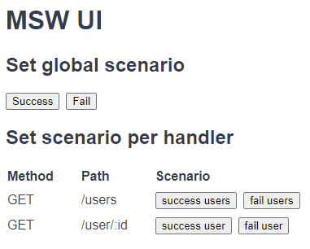

# Mock Service Worker UI

[Mock Service Worker](https://mswjs.io) is an awesome tool to setup mock responses for HTTP calls in the browser or in Node.

One of the benefits is that you can mock all requests to external APIs with a static mock reponse for rapid prototyping or quick local frontend development.

The nature of MSW is that all mocked handlers are set using code and the MSW client runs inside your application. This makes it hard to override handlers.

MSW-UI is an extension on top of MSW that allows you to set new mock handlers on run time, based on scenarios. A scenario is in fact a preset to set multiple handlers at once.
Then it is just as simple as calling `setScenario('badrequest')` somewhere in your code to activate the 'badrequest' scenario that you have defined upfront.

To prevent you from mixing `setScenario` calls with production code, this library also contains a Vue page component that you can lazy load in Vue router only when `process.NODE_ENV === 'development'`. This is to ensure that you never ship any MSW-UI (or MSW) code to production.
This component renders a simple but effective UI to quickly activate one of the scenarios.



## How to use

1. `npm install msw-ui -D`
2. Add MSW to your project (see [MSW docs](https://mswjs.io/docs/getting-started/integrate/browser))
3. Define global scenarios and/or scenarios per endpoint, for example

```typescript
// mocks.ts

// Global scenarios to set multiple endpoints
export const scenarios: Record<string, RestHandler[]> = {
  success: [rest.get('/users', usersSuccess), rest.get('/user/:id', userSuccess)],
  fail: [rest.get('/users', usersFail), rest.get('/user/:id', userFail)],
};

// Scenarios per handler
export const scenariosPerHandler: Record<string, Record<string, RestHandler>> = {
  'GET /users': {
    'success users': rest.get('/users', usersSuccess),
    'fail users': rest.get('/users', usersFail),
  },
  'GET /user/:id': {
    'success user': rest.get('/user/:id', userSuccess),
    'fail user': rest.get('/user/:id', userFail),
  },
};
```

4. Register the scenarios with MSW-UI. Usually you do this after the `setupWorker()` call

```typescript
import { register } from 'msw-ui';
import { scenarios, scenariosPerHandler } from './mocks';

register(worker, scenarios, scenariosPerHandler);
```

5. Somewhere in your code call `setScenario('success')` to set handlers for the global 'success' scenario or `setScenarioForHandler('GET /users', 'success users')` for an endpoint specific scenario.

You could also skip step 4 and use the UI to set scenarios directly from the browser.

6. Integrate the page component into your Vue app that has Vue Router enabled (sorry no support for other frameworks or vanilla JS yet, but you could easily create something yourself):

```typescript
// router/index.js
import { MSWUI } from 'msw-ui';

const routes: Array<RouteRecordRaw> = [
  // ...
  {
    path: '/msw-ui',
    name: 'MSW UI',
    component: MSWUI,
  },
];
```

7. Visit `/msw-ui` in your local app

## Future work

- Despite these docs say you can install MSW-UI via npm, it isn't published yet. So for now you need to copy msw-ui.ts and optionally MSW-UI.Vue into your own project.
- When you hard refresh the page, the MSW client is reinitialized so that all handlers are gone. You also can't see which scenarios are currently active. This is a MSW shortcoming which could be implemented in MSW-UI.
- Theoretically all the scenario stuff should also work in Node but I haven't tested it yet. The use case is also less strong because usually you use MSW in unit tests and you will set mocks manually during a specific test.
- This project is not unit tested yet. How ironic.

## Run example locally

To see how it works, clone this repo and install dependencies and start the dev server on http://localhost:8080.
Don't forget to open your browser development tools to see MSW and MSW-UI logging.

```
npm install
npm run serve
```
